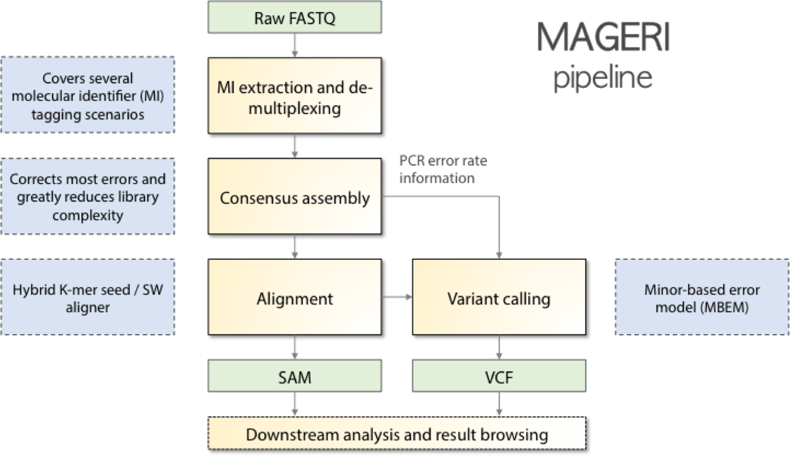
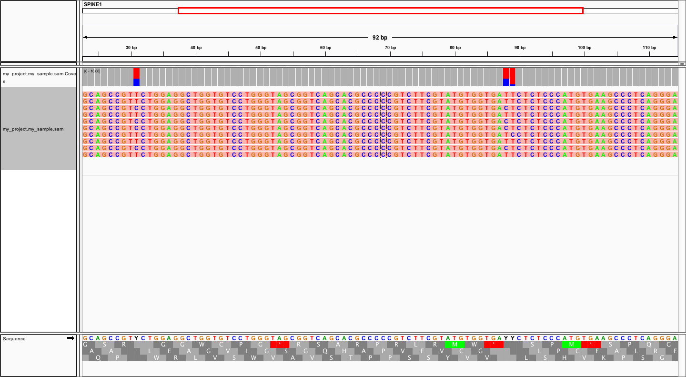

.. mageri documentation master file, created by
   sphinx-quickstart on Fri Aug  7 02:04:16 2015.
   You can adapt this file completely to your liking, but it should at least
   contain the root `toctree` directive.

MAGERI: Molecular tAgged GEnome Re-sequencing pIpeline
======================================================

    
Terminology
-----------

- UMI - unique molecular identifier, a short (typically 6-20nt) degenerate nucleotide sequence, that is attach to cDNA/DNA molecules in order to trace them throughout the entire experiment.
- Sample barcode - a short specific nucleotide sequence used to mark cDNA/DNA molecules that correspond to a given sample in a pooled sequencing library
- MIG - molecular identifier group, a set of reads or read pairs that have an identical UMI sequence
- MIG consensus - the consensus sequence of MIG, calculated from MIG position-weight matrix by taking the letter with highest frequency at each position
- CQS - consensus quality score, calculated as the maximal relative nucleotide frequency at a given PWM position. Usually scaled to [2, 40] range to fit Phred33 string representation. Indicates our confidence in the consensus sequence at a given position.
- Major variant (aka dominant variant, supermutant) - a sequence variant that is present in MIG consensus sequence
- Minor variant - a sequence variant that is present in reads within an MIG, but doesn’t get to the final MIG consensus sequence
- Hot-spot error - an error that is frequent enough to be able to reach a frequency within MIG higher than the current CQS threshold

Installation and running
------------------------

MAGERI is distributed in a form of executable JAR file and requires 
`Java v1.8 <http://www.oracle.com/technetwork/java/javase/downloads/jre8-downloads-2133155.html>`__ to run. 
Source code and released binaries can be found in corresponding 
`repository <https://github.com/mikessh/mageri>`__.

To run MAGERI execute 

.. code-block:: bash

   java -Xmx64G -jar mageri.jar [arguments]
   
The ``-Xmx64G`` option sets the memory usage limit that should be enough 
for most situations. The list of arguments is given by ``-h`` option 
and described below as well.

+--------------------+----------------+-------------------------------------------------------------------------------------------------------+
| option             | argument       | description                                                                                           |
+====================+================+=======================================================================================================+
| ``-R1``            | fastq[.gz]     | First read file.                                                                                      |
+--------------------+----------------+-------------------------------------------------------------------------------------------------------+
| ``-R2``            | fastq[.gz]     | Second read file [optional].                                                                          |
+--------------------+----------------+-------------------------------------------------------------------------------------------------------+
| ``--platform``     | string         | Platform: Illumina, IonTorrent or Roche454 [default = Illumina].                                      |
+--------------------+----------------+-------------------------------------------------------------------------------------------------------+
| ``--library-type`` | string         | Library prep start, SS (single-stranded, linear PCR) or DS (double-stranded) [default=SS].            |
+--------------------+----------------+-------------------------------------------------------------------------------------------------------+
| ``--project-name`` | string         | Project name [optional].                                                                              |
+--------------------+----------------+-------------------------------------------------------------------------------------------------------+
| ``--sample-name``  | string         | Sample name [optional].                                                                               |
+--------------------+----------------+-------------------------------------------------------------------------------------------------------+
| ``-O``             | path           | Path to output folder [default = current folder].                                                     |
+--------------------+----------------+-------------------------------------------------------------------------------------------------------+
| ``-M1``            | metadata file  | De-multiplexing, primer trimming and barcode extraction using specified metadata file. See :ref:`m1`  |
+--------------------+----------------+-------------------------------------------------------------------------------------------------------+
| ``-M2``            | metadata file  | Primer trimming and barcode extraction using specified metadata file. See :ref:`m2`                   |
+--------------------+----------------+-------------------------------------------------------------------------------------------------------+
| ``-M3``            | mask1[:mask2]  | Positional UMI extraction. See :ref:`m3`                                                              |
+--------------------+----------------+-------------------------------------------------------------------------------------------------------+
| ``-M4``            |                | Preprocessed data, UMI information is stored in header. See :ref:`m4`                                 |
+--------------------+----------------+-------------------------------------------------------------------------------------------------------+
| ``--references``   | FASTA file     | File with reference sequences. See :ref:`fa`                                                          |
+--------------------+----------------+-------------------------------------------------------------------------------------------------------+
| ``--bed``          | BED file       | Genomic coordinates of reference sequences [optional]. See :ref:`bed`                                 |
+--------------------+----------------+-------------------------------------------------------------------------------------------------------+
| ``--contigs``      | metadata file  | File with contig names, lengths, and assembly id [optional]. See :ref:`asm`                           |
+--------------------+----------------+-------------------------------------------------------------------------------------------------------+

.. warning::

   One of ``M1-4`` options should be specified. While 
   ``--bed`` and ``--contigs`` parameters are optional, if not specified,
   resulting SAM and VCF files could not be directly annotated and 
   visualized using data from corresponding genome assembly.

Input
-----

MAGERI accepts paired or single-end raw sequencing reads in `FASTQ <https://en.wikipedia.org/wiki/FASTQ_format>`__ format with 
Phred33 quality encoding, either uncompressed or GZIP-compressed. 
To run the pipeline, user should specify pre-processing options which 
tell the software how to extract UMI sequences and sample barcodes 
in case the latter are incorporated into the adapter sequence. Additionally, 
genomic information for reference sequences can be provided to be used 
during mapping and VCF/SAM file generation.

.. note::

   Genomic information bundle for genes from Cancer Gene Census (``hg38`` genome assembly) 
   is available `here <https://github.com/mikessh/mageri>`__

Pre-processing
^^^^^^^^^^^^^^

.. _m1:

Multiplex (M1)
~~~~~~~~~~~~~~

In this mode it is assumed that samples are multiplex with barcodes in 
adapter sequences that additionally cary a UMI tag. In this case  
tab-delimited barcodes table should be provided, e.g.:

+---------------+--------------+--------------------------------------+--------------------------------------+
| sample_name   | master_first |  master_adapter                      | slave_adapter                        |
+===============+==============+======================================+======================================+
| Sample1       |   0          | NNNNNNNNNNNNNNctctcATGC              | GATTTttcaNNNNNNNNNNNNNN              |
+---------------+--------------+--------------------------------------+--------------------------------------+
| Sample2       |   1          | NNNNNNNNNNNNNNtgaaATAGC              | GCATgagagaNNNNNNNNNNNNNN             |
+---------------+--------------+--------------------------------------+--------------------------------------+
| Sample3       |   1          | NNNNNNNNNNNNNNtgaaTAGCA              | GCATgagagaNNNNNNNNNNNNNN             |
+---------------+--------------+--------------------------------------+--------------------------------------+
| Sample4       |   1          | NNNNNNNNNNNNNNtgaaATAGC              |                                      |
+---------------+--------------+--------------------------------------+--------------------------------------+
| ...           |              |                                      |                                      |
+---------------+--------------+--------------------------------------+--------------------------------------+

Samples are de-multiplexed based on master adapter sequence and filtered for matching
slave adapter sequence in case it is provided (paired-end data). Master adapter is first 
searched in both read#1 and read#2. Then the mate read of the master adapter-containing read is 
reverse-complemented and searched for slave adapter sequence if it is provided. 
Simply speaking, master and slave adapter sequences should be provided as 
if they were on the same strand.

After matching and UMI extraction, reads are oriented to be on the same strand and adapter sequences are trimmed. 
If ``master_first`` is set to ``0`` reads are swapped and reverse-complemented.
De-multiplexed samples are further analyzed separately.

The following rules apply to master and slave adapter sequence specification:

-  Slave adapter sequence could be omitted, master adapter sequence should be unique for each sample.

-  Adaptor sequence can contain any IUPAC DNA letters.

-  Upper and lower case letters mark seed (exact match) and fuzzy-search region parts
   respectively.

-  *N* characters mark UMI region to be extracted.

-  Multiple rows could correspond to the same sample

.. _m2:

Primer (M2)
~~~~~~~~~~~

This is a variant of ``-M1`` mode that extracts UMIs and removes primer sequences, but processes 
all reads together as if they were coming from the same sample, e.g.

+---------------+--------------+--------------------------------------+--------------------------------------+
| region_name   | master_first |    left_primer                       | right_primer                         |
+===============+==============+======================================+======================================+
| ARAF_E7_F     |   1          | NNNNNNNNNNNNNNactgtGACCCGGAgcact     | cacaGGGCAGAGggtagag                  |
+---------------+--------------+--------------------------------------+--------------------------------------+
| BRAF_E15_F    |   1          | NNNNNNNNNNNNNNcataaTGCTTGCTctgatagga | ggagTGGGTCCCatcagttt                 |
+---------------+--------------+--------------------------------------+--------------------------------------+
| ...           |              |                                      |                                      |
+---------------+--------------+--------------------------------------+--------------------------------------+

.. _m3:

Positional (M3)
~~~~~~~~~~~~~~~

This mode is specified by one or two masks which are used to scan the first read and 
the reverse complement of the second read. As always, `N` characters are used to specify 
UMI positions. Nucleotides (including ambiguity codes) require exact match, while `n` 
characters are used to specify offset. For example

-  ``-M3 NNNNN`` will use first 5 bases of read#1 as UMI.
-  ``-M3 nnnNNNNN`` will use bases from 4 to 8 of read#1 as UMI.
-  ``-M3 nnnNNNNNatgc`` will scan read#1 for `nnnNNNNNatgc`, `nnNNNNNatgc`, `nNNNNNatgc` and `NNNNNatgc` until matching the `atgc` string.
-  ``-M3 NNNNN:NNNNN`` will extract first 5 bases of read#1 and last 5 bases of reverse complement of read#2.

.. warning::

   This mode should be used with caution for non-oriented reads, as 
   only one read pair orientation will be scanned.

.. _m4:

Header (M4)
~~~~~~~~~~~

If this mode is specified, it is assumed that FASTQ files contain `UMI:NNN:QQQ` entry 
in read headers, separated by tab or space from other header entries.
Here `NNN` are UMI nucleotides and `QQQ` are corresponding quality Phred scores.

Genomic information
^^^^^^^^^^^^^^^^^^^

.. _fa:

Sequences
~~~~~~~~~

MAGERI requires a reference file in `FASTA <https://en.wikipedia.org/wiki/FASTA_format>`__ format to run the alignment and variant calling. 
Note that by default more than 30% of MIG consensus sequence should align to targeted region, 
so ideally adapter/primer trimming is recommended. In case of targeted capture (e.g. exome sequencing), 
upstream and downstream regions (``+/- readlength/2`` bases) of exons should be included. 
Typical reference FASTA file should look like

::

   >HER3_E2
   CGGCGATGCTGAGAACCAATACCAGACACTGTACAAGCTCTACGAGAGGTGTGAGGTGGTGATGGGGAACCTTGAGATTGTGCTCACGGGAC
   >HER3_E3
   CTATGTCCTCGTGGCCATGAATGAATTCTCTACTCTACCATTGCCCAACCTCCGCGTGGTGCGAGGGACCCAGGTCTACGATGGGAAGTTTGCCATCTTCGTCATGTTGAACTATAACACCAACTCC
   >HER3_E6
   TTCTCTCCTTCCATAGTGACCAAGACCATCTGTGCTCCTCAGTGTAATGGTCACTGCTTTGGGCCCAACCCCAACCAGTGCTGCCATGATGAGTGTGCCGGGGGCTGCTCAGGCCCTCAGGACACAGACTGCTTTGTATG
   >HER3_E7
   CCACAGCCTCTTGTCTACAACAAGCTAACTTTCCAGCTGGAACCCAATCCCCACACCAAGTATCAGTATGGAGGAGTTTGTGTAGCCAGCTGTCCCCGTAAGTGTCTGAGGGGAAGGA
   >HER3_E8
   TCATCTCTAATGGTGTCCTCCTCCTCTTCCCTAGATAACTTTGTGGTGGATCAAACATCCTGTGTCAGGGCCTGTCCTCCTGACAAGATGGAAGTAGATAAAAATGGGCTCAAGATGTGTGAGCCTTGTGGGGGACTATGTCCCAAAGGTGGGTAG
   >HER3_E9
   GGGAACAGGCTCTGGGAGCCGCTTCCAGACTGTGGACTCGAGCAACATTGATGGATTTGTGAACTGCACCAAGATCCTGGGCAACCTGGACTTTCTGATCAC
   >HER3_E21
   TACAGGGAATGTACTACCTTGAGGAACATGGTATGGTGCATAGAAACCTGGCTGCCCGAAACGTGCTACTCAAGTCACCCAGTCAGGTTCAGGTGGCAGATTTTGGTGTGGCTGACCTGCTGCCTCCTGATGATAAGCAGC
   >HER3_E23
   TTCCTGCAACAGGTGTGACAGTTTGGGAGTTGATGACCTTCGGGGCAGAGCCCTATGCAGGGCTACGATTGGCTGAAGTACCAGACCTGCTAGAGAAGGGGGAGCGGTTGGCACAGCCCCAGATCTGCACAATTGATGTCTACA

.. _bed:

Coordinates
~~~~~~~~~~~

In order to make output feasible for post-analysis and visualization, a `BED <https://genome.ucsc.edu/FAQ/FAQformat.html#format1>`__ file 
containing genomic coordinates of references should be included. For the example FASTA file above it should be

::

   #chr	start	end	name	unused	strand
   chr12	56477568	56477659	HER3_E2	0	+
   chr12	56478798	56478924	HER3_E3	0	+
   chr12	56481562	56481701	HER3_E6	0	+
   chr12	56481849	56481966	HER3_E7	0	+
   chr12	56482292	56482447	HER3_E8	0	+
   chr12	56482538	56482639	HER3_E9	0	+
   chr12	56491563	56491703	HER3_E21	0	+
   chr12	56492530	56492673	HER3_E23	0	+

.. note::

   FASTA entries that do not have corresponding BED rows will be skipped from 
   SAM and VCF output (but not from internal MAGERI output files).

.. _asm:

Contigs
~~~~~~~

Genome assembly metadata file is required to create SAM and VCF file headers, here is 
an example tab-delimited table for ``hg19`` genome assembly

::

   #chrom	assembly	length
   chr12	hg19	133851895

Again, contig names (``chr12``,...) and coordinates in BED file should be concordant 
with assembly metadata file.

Output
------

MAGERI generates multiple internal output files summarizing each pipeline step

1. ``*.checkout.txt`` - de-multiplexing and UMI extraction yield
2. ``*.umi.histogram.txt`` - MIG size distribution
3. ``*.assemble.txt`` - MIG consensus assembly efficiency; ``*.assemble.R1/2.fastq.gz`` - assembled consensus sequences in FASTQ format with CQS quality scores
4. ``*.mapper.txt`` - MIG consensus mapping statistics for each reference
5. ``*.variant.caller.txt`` - tab-delimited file with variant calls (in original reference coordinates, not genomic ones)

Additionally, mapping and variant calling results are provided in `SAM <https://samtools.github.io/hts-specs/SAMv1.pdf>`__ and
`VCF <http://www.1000genomes.org/wiki/analysis/variant%20call%20format/vcf-variant-call-format-version-41>`__ formats

Example SAM output:

::

   @HD     VN:1.0  SO:unsorted     GO:query
   @SQ     SN:chr1 LN:249250621    AS:hg19
   @SQ     SN:chr2 LN:243199373    AS:hg19
   @SQ     SN:chr3 LN:198022430    AS:hg19
   @SQ     SN:chr4 LN:191154276    AS:hg19
   @SQ     SN:chr5 LN:180915260    AS:hg19
   @SQ     SN:chr6 LN:171115067    AS:hg19
   @SQ     SN:chr7 LN:159138663    AS:hg19
   @SQ     SN:chr8 LN:146364022    AS:hg19
   @SQ     SN:chr9 LN:141213431    AS:hg19
   @SQ     SN:chr10        LN:135534747    AS:hg19
   @SQ     SN:chr11        LN:135006516    AS:hg19
   @SQ     SN:chr12        LN:133851895    AS:hg19
   @SQ     SN:chr13        LN:115169878    AS:hg19
   @SQ     SN:chr14        LN:107349540    AS:hg19
   @SQ     SN:chr15        LN:102531392    AS:hg19
   @SQ     SN:chr16        LN:90354753     AS:hg19
   @SQ     SN:chr17        LN:81195210     AS:hg19
   @SQ     SN:chr18        LN:78077248     AS:hg19
   @SQ     SN:chr19        LN:59128983     AS:hg19
   @SQ     SN:chr20        LN:63025520     AS:hg19
   @SQ     SN:chr21        LN:48129895     AS:hg19
   @SQ     SN:chr22        LN:51304566     AS:hg19
   @SQ     SN:chrX LN:155270560    AS:hg19
   @SQ     SN:chrY LN:59373566     AS:hg19
   @RG     ID:3    SM:h1-1 PU:h1-1 LB:p126-1       PL:ILLUMINA
   @PG     ID:mageri    VN:1.0.0  CL:mageri-1.0.0.jar -I project-1.json -O output/
   TGTATATCCCCTGA  16      chr1    115258663       30      20S131M22S      *       0       0       AGGTCAGCGGGCTACCACTGGGCCTCACCTCTATGGTGGGATCATATTCATCTACAAAGTGGTTCTGGATTAGCTGGATTGTCAGTGCGCTTTTCCCAACACCACCTGCTCCAACCACCACCAGTTTGTACTCAGTCATTTCACACCAGCAAGAACCTGTTGGAAACCAGTAA       GHGGHHHHHHHHHHHHHHHHHHHHHHHHIHIHHHHHHHHHHHHHIHHHHHIHIHIHHIHHHHHIIIIHHIHHHHIHHHHHHHHHHHHHHHHHHHHHHHHHHHHHHHIHHHHHIHHHHHHHHHHHHHHHHHHHHHHHHHHHHHIHHIIHHHIHHIHHHHHHHHHIIHIHHHHIH       RG:Z:3
   GTGTAATTAAATGA  0       chr2    209113093       28      22S103M21S      *       0       0       CATTATTGCCAACATGACTTACTTGATCCCCATAAGCATGACGACCTATGATGATAGGTTTTACCCATCCACTCACAAGCCGGGGGATATTTTTGCAGATAATGGCTTCTCTGAAGACCGTGCCACCCAGAATATTTCGTATGGTG  HHHIHHHHHIHIHIIHHHIIHIIHIHIIHHHGIIIHIHHHHIHHHHHHHHHHHHHHIHHIIIHHHHHIHHHHHHHIHHHHHHHHHHHIIIHIIHHIHHHHHHHHHHHHHHHHHIHHHIHHHHHIHIHHHHHHHHHHHHHHHHHHHH      RG:Z:3

Example VCF output:

::

   ##fileformat=VCFv4.0
   ##fileDate=Tue Jun 02 05:30:36 GMT+03:00 2015
   ##source=mageri-1.0.0
   ##reference=file:///data/misha/P126/meta/refs.fa
   ##contig=<ID=chr1,assembly=hg19,length=249250621>
   ##contig=<ID=chr2,assembly=hg19,length=243199373>
   ##contig=<ID=chr3,assembly=hg19,length=198022430>
   ##contig=<ID=chr4,assembly=hg19,length=191154276>
   ##contig=<ID=chr5,assembly=hg19,length=180915260>
   ##contig=<ID=chr6,assembly=hg19,length=171115067>
   ##contig=<ID=chr7,assembly=hg19,length=159138663>
   ##contig=<ID=chr8,assembly=hg19,length=146364022>
   ##contig=<ID=chr9,assembly=hg19,length=141213431>
   ##contig=<ID=chr10,assembly=hg19,length=135534747>
   ##contig=<ID=chr11,assembly=hg19,length=135006516>
   ##contig=<ID=chr12,assembly=hg19,length=133851895>
   ##contig=<ID=chr13,assembly=hg19,length=115169878>
   ##contig=<ID=chr14,assembly=hg19,length=107349540>
   ##contig=<ID=chr15,assembly=hg19,length=102531392>
   ##contig=<ID=chr16,assembly=hg19,length=90354753>
   ##contig=<ID=chr17,assembly=hg19,length=81195210>
   ##contig=<ID=chr18,assembly=hg19,length=78077248>
   ##contig=<ID=chr19,assembly=hg19,length=59128983>
   ##contig=<ID=chr20,assembly=hg19,length=63025520>
   ##contig=<ID=chr21,assembly=hg19,length=48129895>
   ##contig=<ID=chr22,assembly=hg19,length=51304566>
   ##contig=<ID=chrX,assembly=hg19,length=155270560>
   ##contig=<ID=chrY,assembly=hg19,length=59373566>
   ##phasing=none
   ##INFO=<ID=DP,Number=1,Type=Integer,Description="Total Depth">
   ##INFO=<ID=AF,Number=.,Type=Float,Description="Allele Frequency">
   ##INFO=<ID=AA,Number=1,Type=String,Description="Ancestral Allele">
   ##INFO=<ID=CQ,Number=1,Type=Integer,Description="Assembly quality">
   ##FILTER=<ID=q20,Description="Quality below 20">
   ##FILTER=<ID=si10000,Description="Singleton, frequency below 10000">
   ##FILTER=<ID=c100,Description="Coverage below 100">
   ##FORMAT=<ID=GT,Number=1,Type=String,Description="Genotype">
   ##INFO=<ID=DP,Number=1,Type=Integer,Description="MIG Depth">
   #CHROM  POS     ID      REF     ALT     QUAL    FILTER  INFO    FORMAT  p126-1.h1-1
   chr1    115252206       .       G       A       16      q20     DP=307;AF=0.0032573289;AA=G;CQ=39.0     GT:DP   0/1:307
   chr1    115258758       .       C       T       383     .       DP=542;AF=0.040590405;AA=C;CQ=39.0      GT:DP   0/1:542
   
Those files can be further used in downstream analysis. For example, SAM files can be viewed in `IGV <https://www.broadinstitute.org/igv/>`__ browser, 
while VCF files can be annotated with `SnpEff <http://snpeff.sourceforge.net/>`__.

Example
-------

A test dataset can be downloaded from `here <_static/example.zip>`__.

To run example, execute 

.. code-block:: bash

   java -jar mageri.jar -M2 primers.txt --references refs.fa -R1 example_R1.fastq.gz -R2 example_R2.fastq.gz out/
   
The resulting VCF file should contain ``31:T>C``, ``88:T>C`` and ``89:T>C`` variants. Manual inspection of SAM suggests
that mutations at position 31 and 88 are linked:

Advanced
--------

Presets
^^^^^^^

MAGERI parameter preset can be changed by exporting, modifying 
and re-importing XML configuration file

.. code-block:: bash

   java -jar mageri.jar --export-preset my_preset.xml
   gedit my_preset.xml
   ...
   java -Xmx64G -jar mageri.jar --import-preset my_preset.xml [arguments]
   
The default XML config file is given below

.. code-block:: xml

   <?xml version="1.0" encoding="UTF-8"?>
   <MageriPresets>
     <version>1.0.0</version>
     <platform>ILLUMINA</platform>
     <libraryType>SS</libraryType>
     <DemultiplexParameters>
       <orientedReads>false</orientedReads>
       <maxTruncations>2</maxTruncations>
       <maxGoodQualMMRatio>0.05</maxGoodQualMMRatio>
       <maxLowQualityMMRatio>0.1</maxLowQualityMMRatio>
       <lowQualityThreshold>20</lowQualityThreshold>
     </DemultiplexParameters>
     <PreprocessorParameters>
       <umiQualThreshold>10</umiQualThreshold>
       <goodQualityThreshold>30</goodQualityThreshold>
       <trimAdapters>true</trimAdapters>
       <minUmiMismatchRatio>20.0</minUmiMismatchRatio>
       <forceOverseq>false</forceOverseq>
       <defaultOverseq>5</defaultOverseq>
     </PreprocessorParameters>
     <AssemblerParameters>
       <offsetRange>4</offsetRange>
       <anchorRegion>8</anchorRegion>
       <maxMMs>4</maxMMs>
       <maxConsequentMMs>3</maxConsequentMMs>
       <qualityWeightedMode>true</qualityWeightedMode>
       <maxDroppedReadsRatio>0.3</maxDroppedReadsRatio>
       <cqsRescue>false</cqsRescue>
       <qualityTrimming>true</qualityTrimming>
       <greedyExtend>true</greedyExtend>
     </AssemblerParameters>
     <ConsensusAlignerParameters>
       <consensusQualityThreshold>30</consensusQualityThreshold>
     </ConsensusAlignerParameters>
     <VariantCallerParameters>
       <order>1.0</order>
       <modelCycles>20.0</modelCycles>
       <modelEfficiency>1.95</modelEfficiency>
       <qualityThreshold>20</qualityThreshold>
       <singletonFrequencyThreshold>10000</singletonFrequencyThreshold>
       <coverageThreshold>100</coverageThreshold>
     </VariantCallerParameters>
   </MageriPresets>

.. toctree::
   :maxdepth: 0
